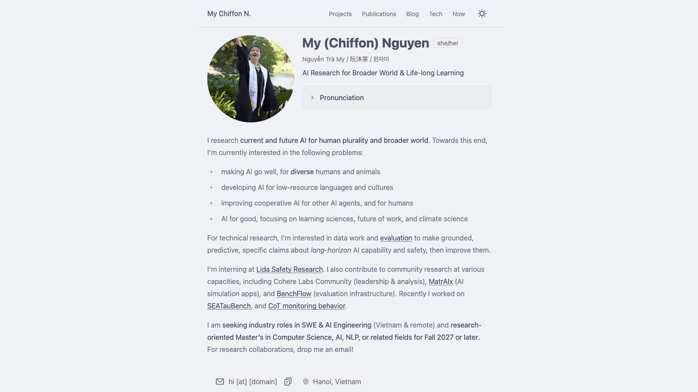
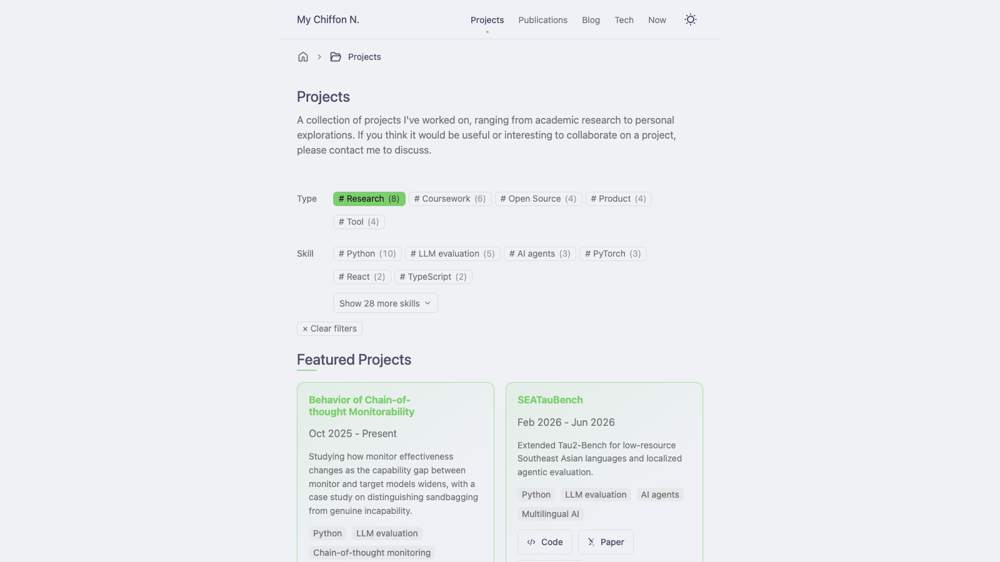
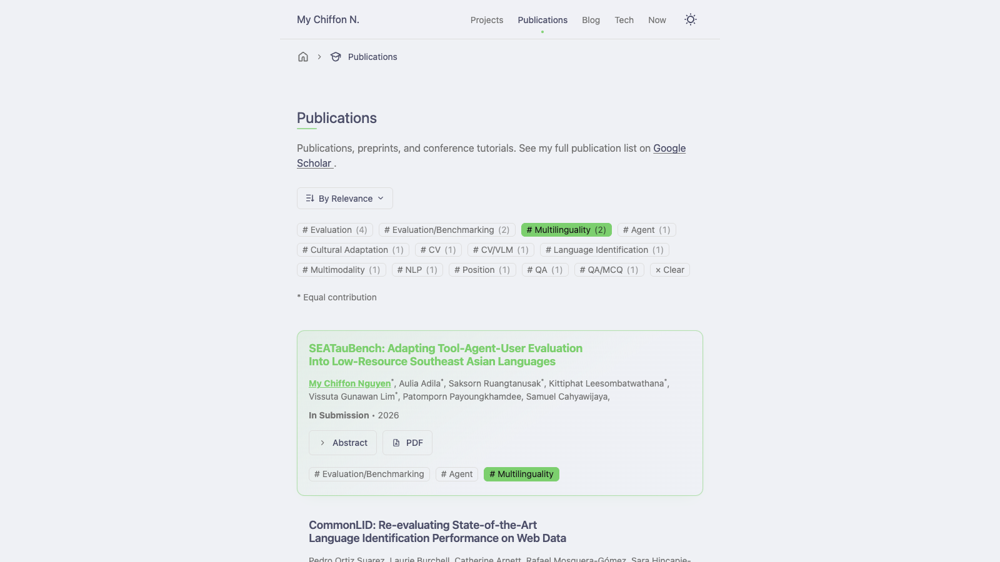
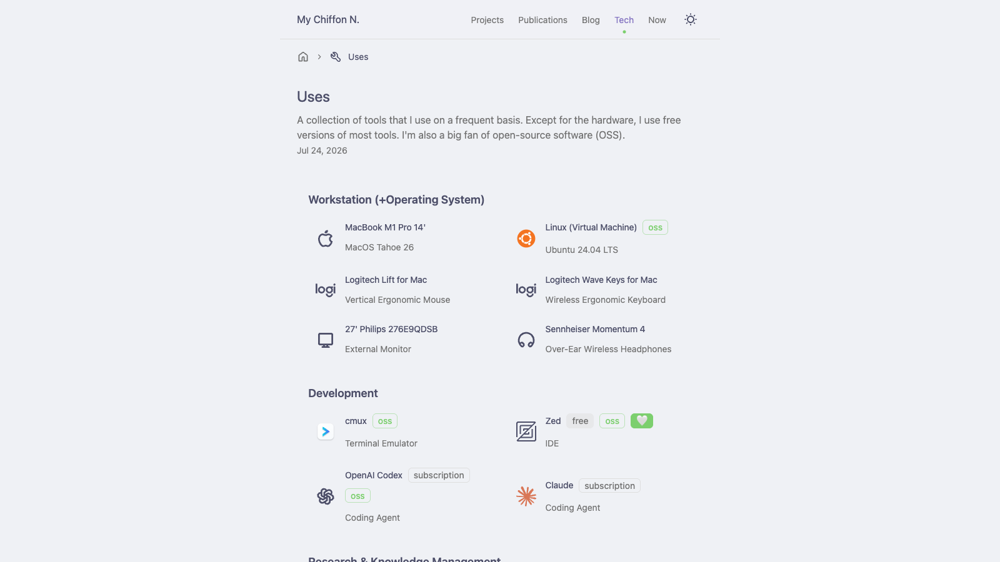
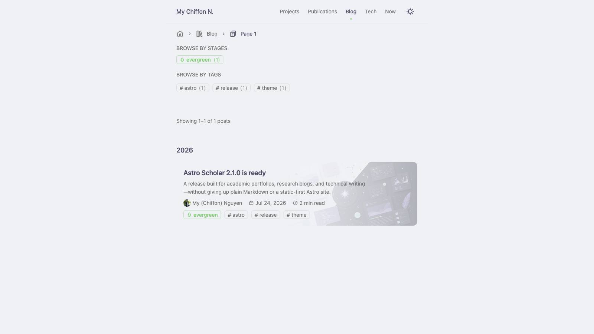
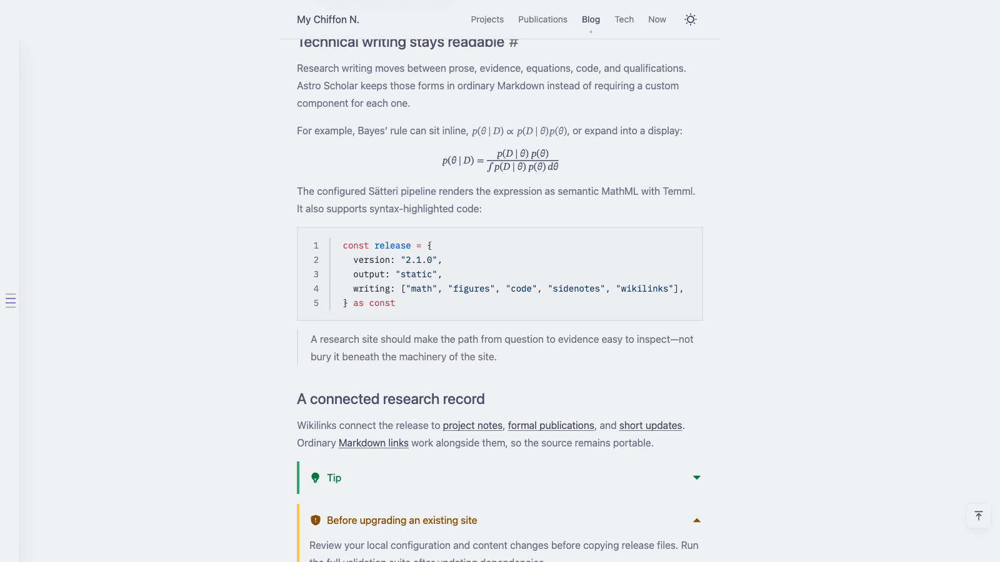
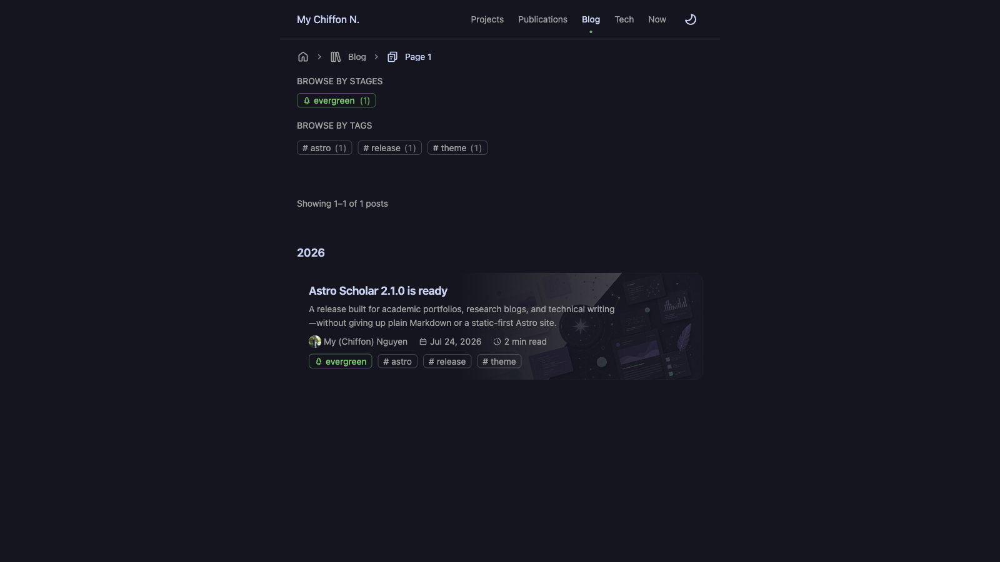
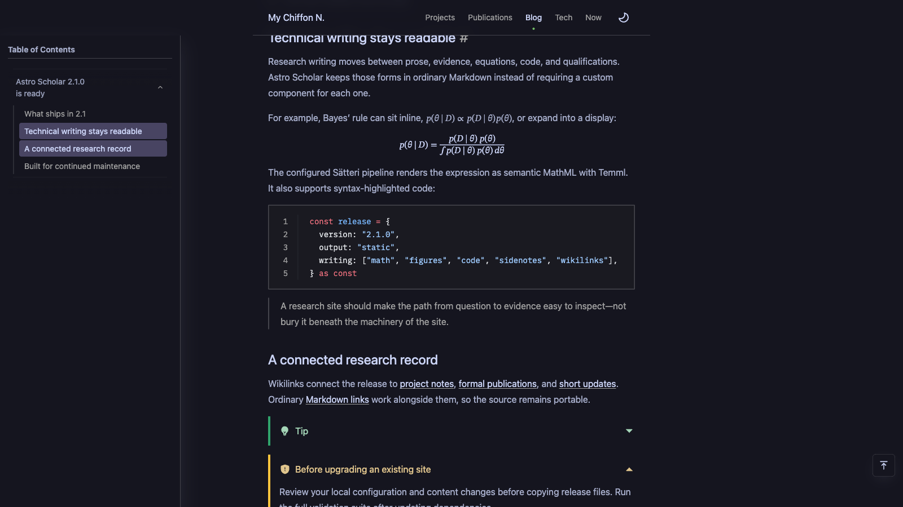

# Astro Scholar

[](https://github.com/mychiffonn/astro-scholar/releases) [](https://astro.build) [](https://www.typescriptlang.org/)


Astro Scholar is an [Astro](https://docs.astro.build/en/concepts/why-astro/)
theme for academic personal sites, research blogs, projects, publications, and
now pages. It is a static-first, Markdown-first starter with generic
demonstration content that researchers can replace with their own work.

## Previews

| Home                                                | Projects                                                    |
| --------------------------------------------------- | ----------------------------------------------------------- |
|  |  |

| Publications                                                        | Uses                                                |
| ------------------------------------------------------------------- | --------------------------------------------------- |
|  |  |

| Blog index (light)                                               | Blog post (light)                                                    |
| ---------------------------------------------------------------- | -------------------------------------------------------------------- |
|  |  |

| Blog index (dark)                                              | Blog post (dark)                                                   |
| -------------------------------------------------------------- | ------------------------------------------------------------------ |
|  |  |

## Features

- Astro 7 with a static-first, content-focused build and support for Astro's
  integration ecosystem.
- Academic profile, projects, updates, blog posts, authors, and publications.
- SEO-included: sitemap, robots.txt, Open Graph metadata, and generated social images.
- Publications rendered from a BibTeX file.
- Markdown-first writing with Sätteri, callouts, math, code highlighting, heading
  anchors, and sidenotes.
- Blog post/subpost system with tags, stages, table of contents, share actions,
  and multiple authors.
- Native CSS with little interaction scripts shipped.
- Local and Iconify-backed SVG icon system.
- Type-safe config and content schemas with Zod.

## Getting Started

Have Node.js `>=22.12.0` and pnpm installed. Create a site directly from the
GitHub starter:

```bash
pnpm create astro@latest --template mychiffonn/astro-scholar
```

Astro's wizard asks for the destination, installs dependencies, and can
initialize Git. See Astro's official
[install and starter-template guide](https://docs.astro.build/en/install-and-setup/#use-a-theme-or-starter-template)
for branch and repository URL options.

Then:

1. Start the development server with `pnpm dev`.
2. Visit <http://localhost:4321>.
3. Follow [docs/INSTALL.md](docs/INSTALL.md) to configure the starter.
4. Personalize content and design with
   [docs/CUSTOMIZATION.md](docs/CUSTOMIZATION.md).

To contribute to the theme itself, clone this repository and run
`corepack enable && pnpm install`.

## Astro and AI-assisted development

Astro's [Build with AI guide](https://docs.astro.build/en/guides/build-with-ai/)
explains how to give coding agents current Astro documentation instead of
relying on potentially stale framework knowledge. This repository also includes
[AGENTS.md](AGENTS.md) with the theme's installation, customization,
development, validation, and publishing conventions.

For supported adapters and integrations, use Astro's setup command:

```bash
pnpm astro add <integration>
```

The command installs the package and updates `astro.config.ts`. Read the
[Astro integrations guide](https://docs.astro.build/en/guides/integrations/)
and the selected integration's documentation first; the theme does not require
a UI framework or server adapter for its default static build.

## Built With

This theme is built on enscribe's
[astro-erudite](https://github.com/jktrn/astro-erudite) v2.0.1, and references
from [Maggie Appleton](https://github.com/MaggieAppleton/maggieappleton.com-V3)'s
digital garden and al-folio.

## Development

- [DEVELOPMENT.md](DEVELOPMENT.md): architecture, commands, Erudite v2
  principles, and theme publishing checklist.
- [CONTRIBUTING.md](CONTRIBUTING.md): contribution workflow and pull request
  expectations.

Common checks:

```bash
pnpm format:check
pnpm lint
pnpm lint:styles
pnpm test:markdown
pnpm astro check
pnpm build
```
